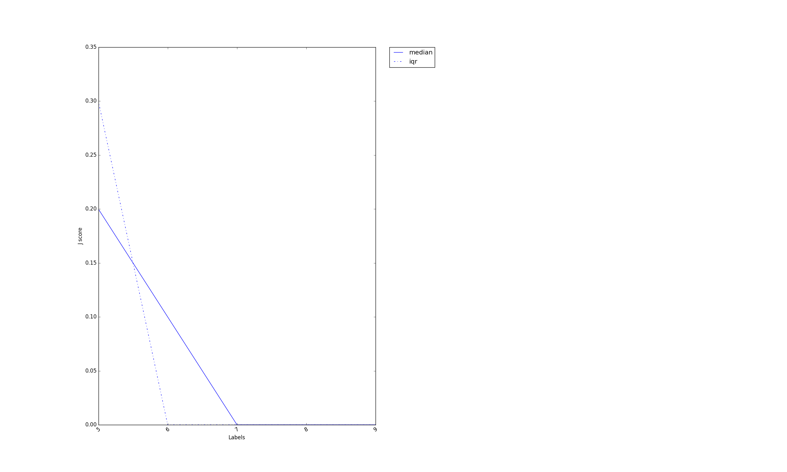

##Experiments
- Repeats: 10
- 300 topics are generated in total over 10 runs, and each run is having 30 topics. Want to see how many topics are produced in subsequent runs.

###Results

### For top5% tfidf scores
X_axis: Jaccard's similarity score when x number of matched terms occur in the intersection of 2 topics


```
5: [0.3, 0.8, 0.2, 0.1, 0.3, 0.4, 0.8, 0.1, 0.9, 0.1, 0.2, 0.4, 0.7, 0.5, 0.3, 0.6, 0.8, 0.9, 0.2, 0.4, 0.1, 0.1, 0.8, 0.3, 0.5, 0.1, 0.1, 0.2, 0.3, 0.2, 0.1, 0.2, 0.3, 0.1, 0.1, 0.1, 0.1, 0.1, 0.2, 0.1, 0.7, 0.5, 0.1, 0.2, 0.1, 0.2, 0.3, 0.1, 0.1, 0.2, 0.2, 0.1, 0.1, 0.1, 0.1, 0.2, 0.1]
6: [0.1, 0.1, 0.1]
7: [0]
8: [0]
9: [0]
```

### For top10% tfidf scores

```
5: [0.9, 0.4, 0.5, 0.6, 0.1, 0.6, 0.1, 0.1, 0.1, 0.5, 0.9, 0.5, 0.3, 0.2, 0.1, 0.2, 0.6, 0.8, 0.5, 0.1, 0.9, 0.6, 0.1, 0.3, 0.5, 0.2, 0.2, 0.1, 0.5, 0.2, 0.1, 0.1, 0.2, 0.2, 0.1, 0.1, 0.3, 0.1, 0.1, 0.1, 0.1, 0.2, 0.2, 0.2, 0.4, 0.1, 0.2, 0.2, 0.1, 0.1, 0.1, 0.1, 0.1]
6: [0.1, 0.2] 
7: [0]
8: [0]
9: [0]
```
